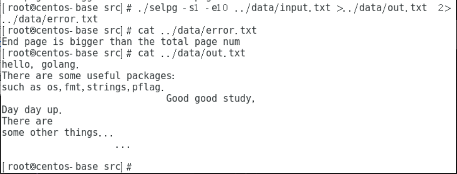
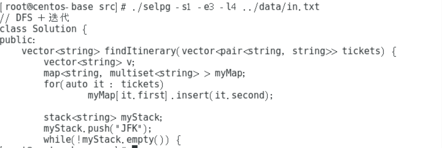
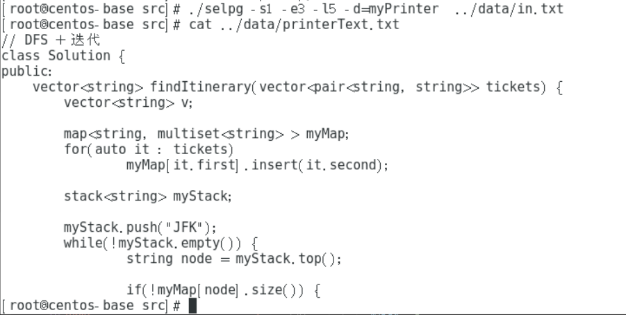

<!-- TOC -->

- [Golang开发Linux命令行实用程序 - selpg](#golang开发linux命令行实用程序---selpg)
  - [1. 介绍](#1-介绍)
  - [2. 设计与实现](#2-设计与实现)
    - [2.1 设计思路](#21-设计思路)
    - [2.2 功能模块划分与实现](#22-功能模块划分与实现)
  - [3 测试](#3-测试)
  - [4 My selpg使用说明](#4-my-selpg使用说明)
    - [4.1 文件结构与说明](#41-文件结构与说明)
    - [4.2 运行](#42-运行)
  - [5 参考文献](#5-参考文献)

<!-- /TOC -->

## Golang开发Linux命令行实用程序 -  selpg
### 1. 介绍

* Linux命令行使用程序 - `selpg`，这个名称代表`SELect PaGes`。selpg允许用户指定从输入文本抽取的页的范围，这些输入文本可以来自文件或另一个进程。
* 关于selpg的详细介绍，参照[**开发Linux命令行实用程序**](https://www.ibm.com/developerworks/cn/linux/shell/clutil/index.html)
* 实现`slepg`代码
  * [我的 - Golang实现](https://github.com/Liu-YT/selpg)
    * [使用说明](#4-my-selpg使用说明)
  * [官方 - C语言实现](https://www.ibm.com/developerworks/cn/linux/shell/clutil/selpg.c)

### 2. 设计与实现

#### 2.1 设计思路

* 理解`selpg`命令的功能以及处理流程。
* `selpg`命令涉及的基本操作
  * 文件的读写
  * 从终端获取输入以及在终端输出

#### 2.2 功能模块划分与实现

* 构建命令行参数的结构体，由于参数使用的比较多，可以使用一个结构体存储起来，使用起来比较方便

  ```go
  type selpg_args struct {
  	startPage      int
  	endPage        int
  	inFile         string
  	pageLen        int
  	pageType       bool // true for -f, false for -lNumber
  	outDestination string
  }
  ```

* 参数解析

  * 使用[pflag包](https://godoc.org/github.com/spf13/pflag)对命令行输入参数进行解析
  * 使用 pflag 替代 goflag 以满足 Unix 命令行规范， 参考：[Golang之使用Flag和Pflag](https://o-my-chenjian.com/2017/09/20/Using-Flag-And-Pflag-With-Golang/)
  * 获得`flag`参数后`pflag.Parse()`函数才能把参数解析出来
  * 使用`pflag.Args()`来获取未被标记的参数

  ```go
  // 解析获取参数
  func getArgs(args *selpg_args) {
    pflag.IntVarP(&(args.startPage), "startPage", "s", -1, "start page")
    pflag.IntVarP(&(args.endPage), "endPage", "e", -1, "end page")
    pflag.IntVarP(&(args.pageLen), "pageLen", "l", 72, "the length of page")
    pflag.BoolVarP(&(args.pageType), "pageType", "f", false, "page type")
    pflag.StringVarP(&(args.outDestination), "outDestination", "d", "", "print destination")
    pflag.Parse()

    other := pflag.Args() // 其余参数
    if len(other) > 0 {
      args.inFile = other[0]
    } else {
      args.inFile = ""
    }
  }
  ```

* 参数检查

  * 检查输入参数的合法性
    * 是否输入了起始页和结束页
    * 起始页大于1小于结束页以及不能溢出（`MaxInt32`）
    * 结束页大于起始页并且不能溢出（`MaxInt32`）
  * 遇到不合法则输出错误同时结束程序

    ```go
    // 检查参数合法性
    func checkArgs(args *selpg_args) {
      if args.startPage == -1 || args.endPage == -1 {
        os.Stderr.Write([]byte("You shouid input like selpg -sNumber -eNumber ... \n"))
        os.Exit(0)
      }

      if args.startPage < 1 || args.startPage > math.MaxInt32 {
        os.Stderr.Write([]byte("You should input valid start page\n"))
        os.Exit(0)
      }

      if args.endPage < 1 || args.endPage > math.MaxInt32 || args.endPage < args.startPage {
        os.Stderr.Write([]byte("You should input valid end page\n"))
        os.Exit(0)
      }

      if (!args.pageType) && (args.pageLen < 1 || args.pageLen > math.MaxInt32) {
        os.Stderr.Write([]byte("You should input valid page length\n"))
        os.Exit(0)
      }
    }
    ```

* 执行命令

  * 执行命令部分主要涉及到文件的读取以及写入或者标准输入的获取以及命令行下输出，我们使用到[bufio包](https://godoc.org/bufio)，至于`-dXXX` 实现，使用到 [os/exec包](https://studygolang.com/articles/3329) 

  * **`bufio包介绍与使用`**

    * `bufio包`实现了带缓存的 I/O 操作，它封装一个 `io.Reader` 或 `io.Writer` 对象，使其具有缓存和一些文本读写功能

      * `func NewReaderSize(rd io.Reader, size int) *Reader`

        `NewReaderSize` 将` rd` 封装成一个带缓存的 `bufio.Reader` 对象，缓存大小由 `size` 指定（如果小于 16 则会被设置为 16）。如果` rd `的基类型就是有足够缓存的 `bufio.Reader` 类型，则直接将rd 转换为基类型返回。

      * `func NewReaderSize(rd io.Reader, size int) *Reader`

        `NewReader `相当于 `NewReaderSize(rd, 4096)`

      * `func (reader *Reader) ReadBytes(delim byte) (line []byte, err error)`

        `ReadBytes` 在 `reader`中查找`delim `并读出 `delim` 及其之前的所有数据。如果 `ReadBytes` 在找到 `delim` 之前遇到错误，则返回遇到错误之前的所有数据，同时返回遇到的错误（通常是 `io.EOF`）。 只有当 `ReadBytes` 找不到 `delim `时，`err` 才不为 `nil`

  * **`os/exec包介绍与使用`**

    * `os/exec`包执行外部命令。它包装了`os.StartProcess`函数以便更容易的修正输入和输出，使用管道连接I/O，以及作其它的一些调整。 
      * `func Command(name string, arg ...string) *Cmd`


        command返回cmd结构来执行带有相关参数的命令，它仅仅设定cmd结构中的Path和Args参数，如果name参数中不包含路径分隔符，command使用LookPath来解决路径问题，否则的话就直接使用name；Args直接跟在command命令之后，所以在Args中不许要添加命令。我们用该命令创建一个命令对象，参数为子进程路径和子进程参数（可选）　
        ```go
        // 指定运行的程序，实现模拟的打印机
        cmd := exec.Command("./" + args.outDestination)
        ```

      * `func (c *Cmd) StderrPipe() (io.ReadCloser, error)`　　
  
        StderrPipe返回一个pipe，这个管道连接到command的标准错误，当command命令退出时，Wait将关闭这些pipe
      * `func (c *Cmd) StdinPipe() (io.WriteCloser, error)`　　　
  
        StdinPipe返回一个连接到command标准输入的管道pipe。我们可以通过在此处写入传输信息，然后作为子进程的标准输入。

    * 对于`-dXXX`的实现，创建一个子进程，让其模拟打印机，使用管道将数据传输给子进程，子进程读取管道内传输的信息并且打印出来。

  * 处理流程

    * 判断是否指定输入文件，为空则将标准输入作为输入，否则为文件流
    * 判断是否为`-d`类型
    * 判断输入类型为`-l`还是`-f`，依据要求读取输入，在输出到标准输出
    * 判断起始页数以及结束页数是否满足实际标准
      ```go
      // 执行命令
      func processInput(args *selpg_args) {

        // read the file
        var reader *bufio.Reader

        if args.inFile == "" {
          reader = bufio.NewReader(os.Stdin)
        } else {
          fileIn, err := os.Open(args.inFile)
          defer fileIn.Close()
          if err != nil {
            os.Stderr.Write([]byte("Open file error\n"))
            os.Exit(0)
          }
          reader = bufio.NewReader(fileIn)
        }

        // output the file
        if args.outDestination == "" {
          // 输出到当前命令行
          outputCurrent(reader, args)
        } else {
          // 输出到目的地
          outputToDest(reader, args)
        }
      }
      ```

      ```go
      // 输出到当前命令行
      func outputCurrent(reader *bufio.Reader, args *selpg_args);

      // 输出到指定目的地
      func outputToDest(reader *bufio.Reader, args *selpg_args);
      ```

  * 具体代码参见[Github项目](https://github.com/Liu-YT/selpg#use)


### 3 测试

1. `$ selpg -s1 -e1 input_file`
   
  

2. `$ selpg -s1 -e1 < input_file`
   
  

3. `$ other_command | selpg -s1 -e1`
   
  

4. `$ selpg -s1 -e1 input_file >output_file`
   
  

5. `$ selpg -s1 -e10 input_file 2>error_file `


  

6. `$ selpg -s1 -e10 input_file >output_file 2>error_file`


  

7. `$ selpg -s1 -e1 input_file | other_command`

  

8. `$ selpg -s1 -e11 input_file 2>error_file | other_command`


  


9.  `$ selpg -s1 -e3 -l4 input_file`''


  


10. `$ selpg -s1 -e3 -f input_file`


  

11. 测试`-dXXX`
  

### 4 My selpg使用说明

#### 4.1 文件结构与说明
  * `src` -- 存储源文件
  * `data` --  存储测试数据以及模拟的打印机打印数据
    * `in.txt` -- 数据没有分页符(`\f`)，但是内容比较多
    * `input.txt` -- 数据中有分页符(`\f`)，但是比较少

#### 4.2 运行
  * 编译模拟打印机程序 -- `myPrinter.go`

    `go build myPrinter.go`
  * 编译`selpg`的程序 -- `selpg.go` 

    `go build selpg.go`

  * 查看`selpg`命令使用

    `selpg -help`


### 5 参考文献

* [PFlag的使用](https://godoc.org/github.com/spf13/pflag)

* [package io](https://godoc.org/io#Pipe)

* [Golang之使用Flag和Pflag](https://o-my-chenjian.com/2017/09/20/Using-Flag-And-Pflag-With-Golang/)

* [Golang中os/exec包的用法](https://studygolang.com/articles/3329)

* [Golang中bufio包的用法](https://studygolang.com/articles/4367)

  ​
